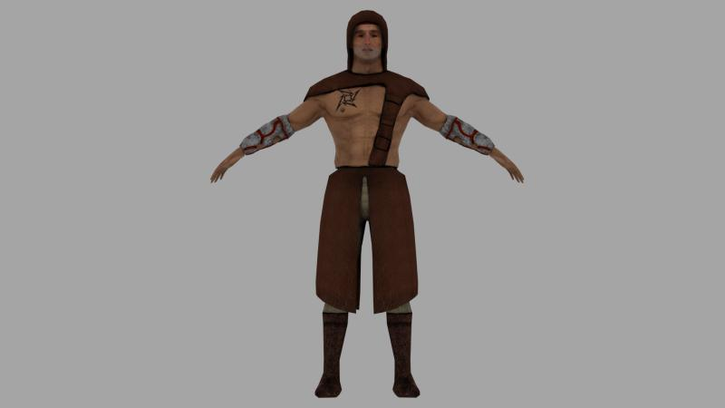
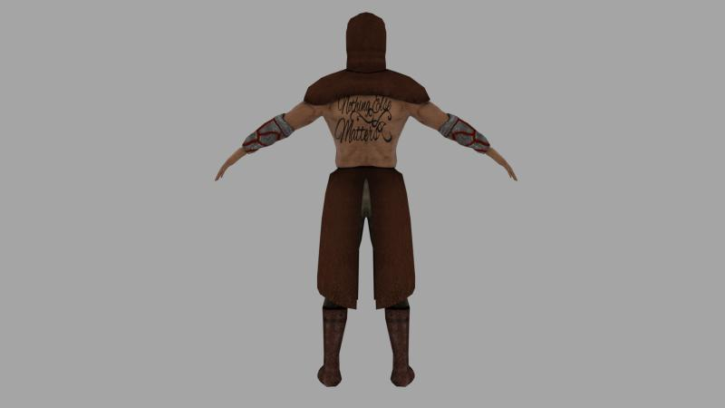

# Low-Poly Humanoid Character 3D Asset

## Overview

This project showcases a **game-ready 3D model low-poly humanoid character in Blender**, developed entirely by me for a future game project.  
This character is ready to be imported into Unity, featuring an **ancient warrior-like appearance** with a shirtless torso, leather boots/accessories, and metal bracelets on both arms. I used advanced techniques and modifiers to achieve efficiency throughout its development.

---

## Technical Specifications

- **Modeling Software**: Blender 3.6.2
- **Polygon Count**: 3,558 vertices
  - Topology: 100% tris/quads (no n-gons) and no non-manifold geometries
- **Texture**: All baked and done by me at 1024x1024.
  - Color, Normal, Ambient Oclusion.

---

## Asset Details

### Modeling Techniques

I used advanced techniques to balance detail and efficiency:

- **Mirror Modifier**: Mirrored half of the character in order to save time and have a consistent mesh.  
- **Multiresolution Sculpting**: Used for detailed features like veins, muscle definition, skin texture and realistic clothing details.  
- **Solidify Modifier**: Some meshes were started as planed which required this modifier. 
- **Shrinkwrap Modifier**: Used for retopology, creating a new low-poly mesh adhering to the sculpt, followed by normal, AO and color map baking.

---

### Rigging and Animations

The character is fully rigged with an armature and includes animations for:  

- Walking  
- Running  
- Jumping  
- Idle motions  

---

### Textures and Materials

Baked maps ensure a high-quality look in-game:

- **Normal Map**: Captures details like veins, muscle definition, and skin texture.  
- **Color/AO Map**: Provides realistic colors for skin, leather and metal, alongside correct simulation of lighting effects.

---

## Use Cases

My asset is best suited for these types of games:

- Action: the ancient warrior aesthetic is fit for this.
- Fantasy: for roles like gladiators, mercenaries or mythical fighters.
- Adventure: a versatile character for exploration and storytelling.

---

## Render Gallery

### Front View - Click on the image to watch a flythrough on Youtube

   
  <em>Click on the image to watch the short trailer on Youtube</em>

### Back View  

  
   

### Side View  

  
   

---

## How to Use

1. Import the FBX file into Unity or any compatible engine.  
2. Verify texture mapping.  
3. Adjust the normal map intensity as needed for the desired visual effect.

---

## Future Improvements

- Expand the character with additional animations for combat.  
- Create variations of the character to fit different roles or classes.  
